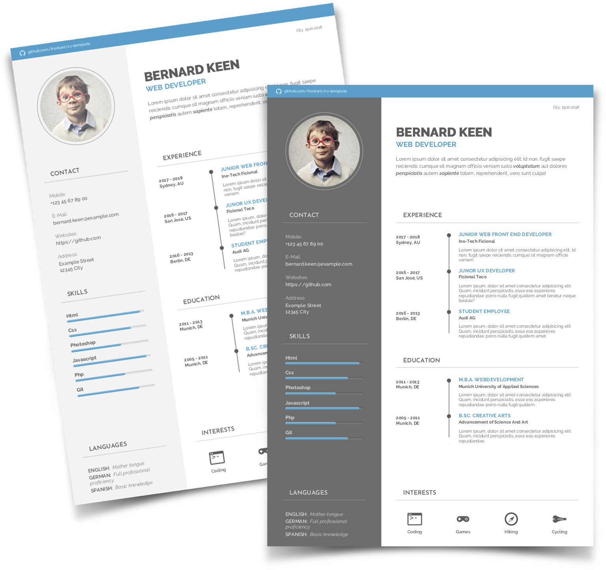
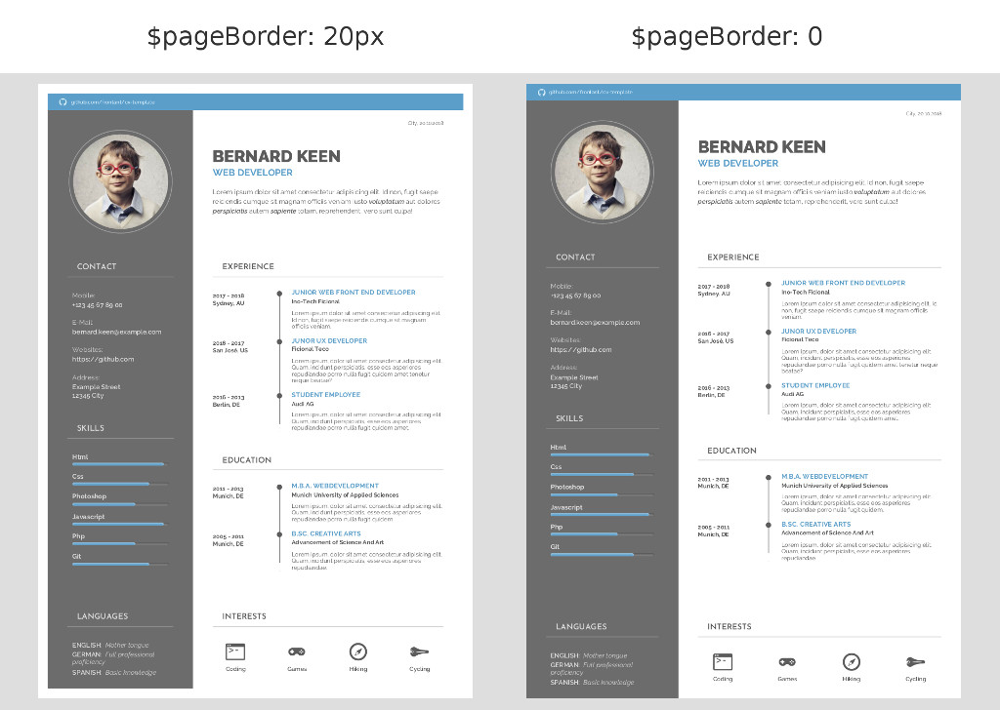

<!--

keywords:
cv-template, cv, resume, curriculum-vitae, template, theme, generator, html, pdf, htmltopdf

-->

<h1 align="center">cv-template</h1>

<h5 align="center">Single page cv-template written in html and built with gulp.</h5>
<p align="center">
    <a href="https://frontant.github.io/demo-sites/cv-template/" target="_blank">HTML</a> |
    <a href="https://frontant.github.io/demo-sites/cv-template/resume-dark.pdf" target="_blank">PDF</a>
</p>

The objective of this project was to develope a good-looking single page curriculum vitae template with the automation tool <a href="https://gulpjs.com/" target="_blank">**gulp**</a> that automates painful or time-consuming tasks in a development workflow.



## Installation

This template depends on:

- <a href="https://nodejs.org/" target="_blank">**node 8.x**</a>
- <a href="https://gulpjs.com/" target="_blank">**gulp**</a>
- **Google Fonts** (<a href="https://fonts.google.com/specimen/Josefin+Sans" target="_blank">**Josefin-Sans**</a> and <a href="https://fonts.google.com/specimen/Raleway" target="_blank">**Raleway**</a>)

The project uses **phantomjs** to transform HTML to PDF. Unfortunately phantomjs can't handle custom fonts defined with @font-face property. To get phantomjs to render HTML files correctly you will need to install fonts on your system.

### Installation (Windows)

1. Download and install the LTS version of <a href="https://nodejs.org/" target="_blank">**Node**</a>
2. Download and unzip the <a href="https://github.com/frontant/cv-template/archive/master.zip" target="_blank">**cv-template-master**</a>
3. Open the terminal (cmd.exe) and run commands:

```shell
 cd cv-template-master
 npm install
 npm install gulp-cli -g
```

4. Now setup fonts. Change to the folder **cv-template-master/app/assets/fonts/**. Open the folder **Raleway**. **Select all fonts** in there and click on the selection with the **right mouse button**, than choose **install**. Do the same with **Josefin_Sans**.

### Installation (Linux)

##### Install Node

The easiest way to install **node** is via the <a href="https://nodejs.org/en/download/package-manager/" target="_blank">**package manager**</a>:

If you use Ubuntu/Debian run:

```shell
 curl -sL https://deb.nodesource.com/setup_8.x | sudo bash -
 sudo apt-get install nodejs
```

##### Install CV-Template, Node Modules and Gulp

Download the <a href="https://github.com/frontant/cv-template/archive/master.zip" target="_blank">**cv-template-master**</a>, unpack the zip file and run:

```shell
 cd ~/Downloads/cv-template-master
 npm install
 sudo npm install gulp-cli -g
```

##### Install Fonts

```shell
 cp -r ~/Downloads/cv-template-master/app/assets/fonts ~/.fonts
```

## Build

```shell
 cd ~/Downloads/cv-template-master
 gulp
```

You can view generated files in the folder **~/Downloads/cv-template-master/app/build/**

## Customize

```shell
# after you make any changes to the template you have to run gulp to rebuild PDF files
 gulp
```

### Edit Content

The content of the **cv-template** is stored in **~/Downloads/cv-template-master/app/contents/index.html.js**.

### Change Photo

To change the profile photo replace **profile-photo.jpg** and **profile-photo-light.jpg** by your own images in the folder **~/Downloads/cv-template-master/app/assets/images/**.

### Change Icons

You can change or add custom icons in the _"INTERESTS"_ section by putting your own graphics (svg, png, jpg) to the folder **~/Downloads/cv-template-master/app/assets/images/icons/**. Finally you will need to edit the file **~/Downloads/cv-template-master/app/contents/index.html.js** and change the value of the **icon** attribute by entering **"icon--"** and **"file name"** without extension.

```js
    interests: {
        title: 'Interests',
        item1: {
            icon: 'icon--terminal',
            caption: 'Coding'
        },
        item2: {
            icon: 'icon--game-controller',
            caption: 'Games'
        },
        item3: {
            icon: 'icon--compass',
            caption: 'Hiking'
        },
        item4: {
            icon: 'icon--saddle',
            caption: 'Cycling'
        }
    }
```

### Page Options

Page Options are placed in the file **~/Downloads/cv-template-master/app/assets/styles/base/\_variables.css**.

```scss
/* page options */
$pageZoom: 1; /* scales page */
$pageZoomOnWindows: 1.333; /* scales page on Windows */
$pageBorder: 0px; /* sets the border size of the page */
```

#### Adjust Page Zoom

I've noticed that **phantomjs** renders HTML pages differently depending on the operating systems it runs on. If PDF files are not correctly rendered on your OS you can fix it by adjusting the variable **\$pageZoom** or **\$pageZoomOnWindows** (on Windows OS).

#### Adjust Page Border

By default the page border is set to 0px. If your printer cuts off the page content you can fix it by increasing the value of the variable **\$pageBorder**.



## Live Preview

The _Live Preview_ is very usefull if you want to view template changes in your browser on the fly, without runnig **gulp** every time. This will only work if you make changes to **index.html**, **index.html.js** files and CSS files in **~/Downloads/cv-template-master/app/assets/styles/** directory. If you make changes to other files you still need to run **gulp**. You can run **gulp** in a separate terminal without stopping the _Live Preview_.

### Run Live Preview

Run with:

```shell
 gulp watch
```

... and stop it by pressing **ctrl + c**.

Now copy the local url that you see in the terminal output to the address bar in your browser. In my case it is **http://localhost:3000**. Here is my output:

```
[12:13:42] Starting 'watch'...
[12:13:42] Finished 'watch' after 69 ms
[Browsersync] Access URLs:
 ----------------------------
 Local: http://localhost:3000
 ----------------------------
    UI: http://localhost:3001
 ----------------------------
[Browsersync] Serving files from: app/build
```

## License

MIT
